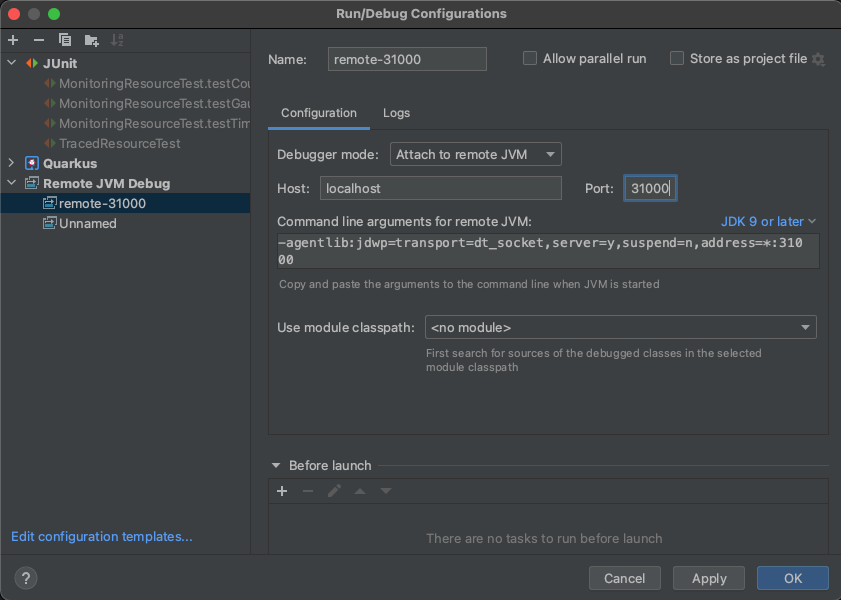
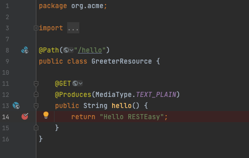

# Chapter 6 - Quarkus REST application & Remote Debug
This is a simple Quarkus JAX-RS project using RESTEasy Reactive that we will use to perform live coding & debugging.

This project uses Quarkus, the Supersonic Subatomic Java Framework. If you want to learn more about Quarkus, please visit its website: https://quarkus.io/.

The [Quarkus Kubernetes extension](https://quarkus.io/guides/deploying-to-kubernetes) will populate the Kubernetes manifest needed to deploy the application 
on a kubernetes cluster while the [Quarkus Container JIB extension](https://quarkus.io/guides/container-image) will build a container image using Google JIB Tool.

## Package the application

Package the application and build/push the container image to docker hub, quay.io, ... using the following command
```shell script
./mvnw clean package
```
**NOTE**: Uncomment the `quarkus.container-image*` properties within the `application.properties` file and change the values according to the registry where you will push the image.
Instead of changing the properties within the file, you can also define them as such:

```bash
./mvnw clean package \
    -Dquarkus.container-image.registry=localhost:5000 \
    -Dquarkus.container-image.group=quarkus \
    -Dquarkus.container-image.tag=1.0 \
    -Dquarkus.container-image.build=true \
    -Dquarkus.container-image.push=true \
    -Dquarkus.container-image.insecure=true \
    -Dquarkus.container-image.name=chapter-6-quarkus-rest-debug
```

## Deploy the application on the Kubernetes platform

Deploy the application
```bash
kubectl create ns quarkus-demo-debug
kubectl apply -f ./target/kubernetes/kubernetes.yml -n quarkus-demo-debug
```
Access it using your browser pointing to the following url `http://chapter-6-quarkus-rest-debug.127.0.0.1.nip.io/hello`.
You will see as response `Hello RESTEasy`.

**WARNING**: Change the domain name using the Ingress or OpenShift route address

## Launch the application locally

- Launch locally your quarkus application containing the code that you would like to change remotely
```bash
./mvnw quarkus:remote-dev
```
- Do some code changes within the code.
- Check again the response using the URL of the endpoint ;-). This new request triggers the recompilation of the code as can be seen in the console output:
```bash
2021-06-02 09:56:25,322 INFO  [io.qua.ver.htt.dep.dev.HttpRemoteDevClient] (Remote dev client thread) Sending dev/app/org/acme/GreeterResource.class
```
As soon as the code has been recompiled, it will be pushed to the remote application running as a linux container within a pod

## Remote debugging

To remote debug the application, it is needed to expose on the cluster the remote port `5005`. 
This could be achieved very easily if you create a Kubernetes Service using as type: `NodePort`
where the target port maps a port exposed on the cluster (e.g: 5005 --> 31000).

- If the ports 31000 and 30000 are exposed on your cluster, then uncomment the following lines within the application.proerpties file
```text
quarkus.kubernetes.service-type=NodePort
quarkus.kubernetes.ports.http.node-port=30000
quarkus.kubernetes.ports.remote.name=http
quarkus.kubernetes.ports.remote.host-port=5005
quarkus.kubernetes.ports.remote.container-port=5005
quarkus.kubernetes.ports.remote.node-port=31000
```
- To configure the java agent of the remote application, uncomment also the following line within the `appliation.properties` file
```text
quarkus.kubernetes.env.vars.JAVA_TOOL_OPTIONS=-agentlib:jdwp=transport=dt_socket,server=y,suspend=n,address=0.0.0.0:5005
```
- Next, re-deploy the application using rhe new manifests file
```bash
kubectl delete -f ./target/kubernetes/kubernetes.yml -n quarkus-demo-debug
kubectl apply -f ./target/kubernetes/kubernetes.yml -n quarkus-demo-debug
```
- Test again the url of the endpoint using your browser and the new address containing the `NodePort` such as `http://127.0.0.1:30000/hello`
- Next, using your IDE, launch a remote debugger




- Add a breakpoint within your code and call the service to debug it




Enjoy to remote debug !

## Clean up
```bash
NAMESPACE=quarkus-demo-debug
kubectl delete -f ./target/kubernetes/kubernetes.yml -n $NAMESPACE
kubectl delete ns $NAMESPACE
```
